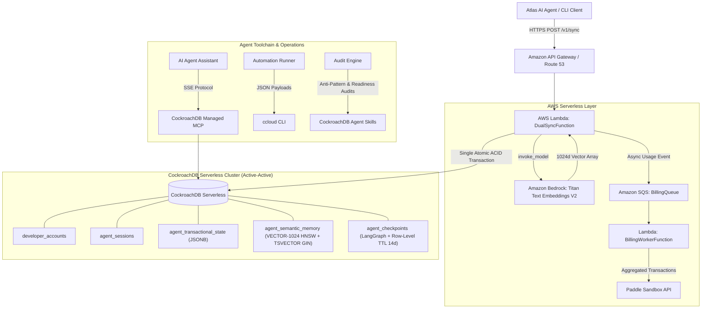

# StateVault: Resilient Multi-Region Memory-as-a-Service for AI Agents

[](LICENSE)
[](https://cockroachlabs.cloud)
[](https://aws.amazon.com)
[](tests/)

**CockroachDB × AWS Hackathon 2026 Submission**

- 🌐 **Live Demo:** [rohitdas-ai.github.io/statevault](https://rohitdas-ai.github.io/statevault)
- 📄 **Full Submission Write-up:** [docs/SUBMISSION.md](docs/SUBMISSION.md)
- 🔌 **MCP Configuration Guide:** [docs/MCP_CONFIG.md](docs/MCP_CONFIG.md)
- 📦 **License:** [MIT](LICENSE)

---

## What is StateVault?

StateVault is an always-on, multi-region **Memory-as-a-Service** layer for autonomous AI agent fleets. It unifies:

- **ACID Transactional State** — structured JSONB operational variables with row-level optimistic versioning
- **Semantic Memory** — 1024-dimensional `pgvector` HNSW embeddings generated by Amazon Bedrock Titan Text Embeddings V2
- **Hybrid Recall** — in-database Reciprocal Rank Fusion (RRF k=60) combining vector cosine similarity + full-text GIN search

All three are committed in a **single atomic ACID transaction** — eliminating the catastrophic "Split-Brain" problem where a vector write fails after a state commit, permanently corrupting agent memory.

---

## The Problem: Split-Brain Desynchronization

Traditional agent stacks split memory across two databases (e.g., PostgreSQL + Pinecone). During any network hiccup or rate limit event:

1. State commits to PostgreSQL ✅
2. Vector write times out to Pinecone ❌
3. Agent memory is **permanently desynchronized** → hallucinations, infinite loops, dropped tasks

**StateVault solves this at the database layer — no middleware, no compensating transactions.**

---

## Architecture



---

## CockroachDB Tools Used

| Tool | How |
|---|---|
| **Managed MCP Server** (`https://cockroachlabs.cloud/mcp`) | Connected AI coding agents (Claude Code, Cursor) for read-only schema introspection, FK topology mapping, and EXPLAIN plan analysis. Zero custom proxies. |
| **Distributed Vector Indexing** (`pgvector` + HNSW) | 1024-dimensional HNSW cosine index (`vector_cosine_ops`) on `agent_semantic_memory`. Powers in-database RRF hybrid search with `TSVECTOR` GIN. |
| **`ccloud` CLI (Agent-Ready)** | Automated cluster health inspection via `scripts/ccloud_check.sh`. Machine-parseable JSON output (`-o json`) for structured health, failover, and storage audits. |
| **Agent Skills Repo** | Schema anti-pattern detection and production readiness verification via `scripts/run_skills_audit.sh` using `@cockroachlabs/skills-cli`. |

---

## AWS Services Used

| Service | How |
|---|---|
| **Amazon Bedrock** | `amazon.titan-embed-text-v2:0` — generates 1024d normalized embeddings per agent memory write |
| **AWS Lambda** | Connection-pooled atomic dual-sync handler (`backend/lambda_function.py`) + billing worker |
| **Amazon SQS** | Decoupled billing event queue (`BillingQueue` + DLQ) preventing rate-limit backpressure from blocking agent transactions |
| **Amazon API Gateway** | HTTPS entry point for `/v1/sync` and `/v1/recall` with API key authentication |

---

## Project Structure

```
statevault/
├── backend/
│   ├── lambda_function.py      # Core dual-sync Lambda: Bedrock → atomic CRDB write
│   ├── context_recall.py       # Hybrid RRF search (vector + full-text)
│   └── billing_worker.py       # SQS consumer → Paddle metered billing
├── agent/
│   └── atlas_agent.py          # Atlas AI Agent orchestration layer
├── database/
│   └── schema.sql              # Full CockroachDB schema (pgvector, TTL, GIN, HNSW)
├── scripts/
│   ├── demo_simulation.py      # Interactive 4-scenario failure simulation
│   ├── ccloud_check.sh         # ccloud CLI health auditor
│   ├── run_skills_audit.sh     # CockroachDB Agent Skills auditor
│   └── deploy.sh               # AWS SAM deployment automation
├── docs/
│   ├── SUBMISSION.md           # Full Devpost submission write-up
│   └── MCP_CONFIG.md           # CockroachDB Managed MCP configuration guide
├── tests/                      # 22 tests — all passing
├── public/
│   └── index.html              # Live demo landing page
└── template.yaml               # AWS SAM infrastructure definition
```

---

## Quickstart & Evaluation

### 1. Clone & Install

```bash
git clone https://github.com/rohitdas-ai/statevault.git
cd statevault
python -m venv .venv && source .venv/bin/activate
pip install -r backend/requirements.txt
```

### 2. Run Test Suite (no credentials needed)

```bash
.venv/bin/pytest -v
# → 22 passed
```

### 3. Run Interactive Failure Simulation (no credentials needed)

```bash
python scripts/demo_simulation.py
```

Demonstrates 4 scenarios:
- Split-brain failure in traditional stacks
- StateVault atomic rollback recovery
- Multi-region outage failover (us-east-1 → us-west-2)
- Hybrid RRF semantic context recall

### 4. Run CockroachDB Toolchain Auditors

```bash
bash scripts/ccloud_check.sh       # ccloud CLI cluster health check
bash scripts/run_skills_audit.sh   # Agent Skills schema validation
```

### 5. Live API Test (judge sandbox)

```bash
curl -X POST https://api.statevault.site/v1/sync \
  -H "x-api-key: statevault_test_token_secret_abc" \
  -H "Content-Type: application/json" \
  -d '{
    "agent_id": "judge_eval_01",
    "state_key": "active_task",
    "state_value": {"step": 1, "task": "benchmark_memory"},
    "raw_text_memory": "Evaluating CockroachDB atomic dual-sync memory performance."
  }'
```

### 6. Deploy to AWS

```bash
bash scripts/deploy.sh
```

---

## Key Design Decisions

- **Single ACID transaction** commits JSONB state + pgvector embedding together. Vector failure = full rollback. No compensating transactions needed.
- **Deterministic vector fallback** — offline 1024d normalized coordinate generator for CI/test runs without AWS IAM credentials.
- **Dual-tier retention** — Row-Level TTL (14 days) on `agent_checkpoints`; operational state and semantic memory persist indefinitely.
- **Namespace scoping** — `<developer_id>:<agent_external_id>:<namespace>` prefix for multi-tenant isolation with index pushdown.
- **Connection pooling** with liveness validation (`SELECT 1`) for Lambda cold-start resilience across multi-region failover.

---

## License

[MIT License](LICENSE) — © 2026 Rohit Das
