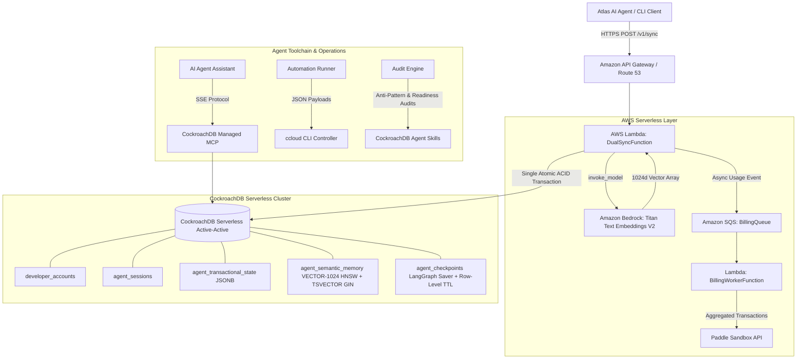

# StateVault: Resilient Multi-Region Memory-as-a-Service for AI Agent Networks

**CockroachDB × AWS Hackathon 2026 Submission**  
- **Live Demo Landing Page:** `https://rohitdas-ai.github.io/statevault`  
- **Public Open-Source Repository:** `https://github.com/rohitdas-ai/statevault`  
- **License:** MIT License (Visible in `LICENSE` file)  
- **Video Screencast:** (< 3 minutes public video link)  

---

## 1. Project Overview & Inspiration

AI agents in production are rapidly replacing brittle manual pipelines. When autonomous agents operate at scale, their memory layer cannot fail. Traditional stacks split memory across two databases: a transactional database for operational state (e.g., PostgreSQL) and a vector database for semantic memory (e.g., Pinecone).

### The Split-Brain Catastrophe
In a fragmented architecture, an agent executing a multi-step task writes its updated operational variables to PostgreSQL. If the separate vector database experiences a network timeout or rate limit, the embedding is lost while the state advances. The agent's memory becomes permanently desynchronized—causing severe hallucinations, dropped tasks, and execution loops.

### The StateVault Solution
StateVault leverages **CockroachDB Serverless** as the unified system of record for agentic memory. Operational state (JSONB) and semantic embeddings (1024-dimensional pgvector with HNSW indexing & TSVECTOR GIN hybrid search) are written in a **single atomic ACID transaction**. If the vector insert fails, the transaction rolls back cleanly. Zero data drift. Zero memory corruption. Zero maintenance windows.

---

## 2. CockroachDB Tools Utilized & How

StateVault integrates all 4 CockroachDB tool ecosystem capabilities:

1. **CockroachDB Cloud Managed MCP Server (`https://cockroachlabs.cloud/mcp`):**
   - *How it was used:* Connected directly to AI coding agents (Claude Code, Cursor, and IDE assistants) using the hosted MCP endpoint. Enables agents to perform secure, read-only schema introspection, foreign key topology mapping, and explain-plan query analysis with zero custom proxies.
2. **Distributed Vector Indexing (`pgvector` with HNSW & Hybrid Search):**
   - *How it was used:* Natively indexes 1024-dimensional normalized embeddings generated by Amazon Titan Text Embeddings V2 alongside stored `TSVECTOR` tokens. Powers in-database **Reciprocal Rank Fusion (RRF k=60)** combining vector cosine similarity with full-text keyword ranking directly in SQL.
3. **Agent-Ready `ccloud` CLI:**
   - *How it was used:* Integrated into deployment and monitoring scripts (`scripts/ccloud_check.sh`). Gives autonomous agents structured, machine-parseable JSON control plane access (`ccloud cluster describe -o json`) to audit multi-region cluster health, failover state, and storage metrics.
4. **CockroachDB Open-Source Agent Skills Repo:**
   - *How it was used:* Encodes database expertise directly into the developer workflow. Executed via `@cockroachlabs/skills-cli` (`scripts/run_skills_audit.sh`) to run both `detect-schema-anti-patterns` and `validate-production-readiness` skills, verifying UUID primary key distribution, Row-Level TTL policies, and vector index configurations.

---

## 3. AWS Services Utilized & How

1. **Amazon Bedrock:**
   - Invokes the `amazon.titan-embed-text-v2:0` foundation model to dynamically encode agent task strings into 1024-dimensional normalized vector coordinates (with deterministic local fallback for offline CI/testing).
2. **AWS Lambda:**
   - Serverless execution environment with a persistent, connection-pooled database handler and automatic connection liveness validation (`SELECT 1`).
3. **Amazon SQS:**
   - Decoupled, asynchronous message queue (`BillingQueue` + DLQ) buffering metered sync actions for batch processing, preventing external API rate limits from blocking agent transactions.
4. **Amazon CloudFront & Route 53:**
   - Active-active multi-region DNS latency routing between `us-east-1` and `us-west-2`, delivering sub-second failover and HTTPS frontend hosting.

---

## 4. Architecture Diagram



---

## 5. Testing Instructions for Judges

Judges can evaluate StateVault via two methods:

### Method A: Interactive Local Simulation Runner (Zero Setup Required)
Run the automated test and simulation suite locally:
```bash
# 1. Run complete automated test suite
.venv/bin/pytest -v

# 2. Run the interactive 4-scenario simulation harness
python scripts/demo_simulation.py

# 3. Run the CockroachDB toolchain auditors
bash scripts/ccloud_check.sh
bash scripts/run_skills_audit.sh
```

### Method B: Live API Testing
Send a live sync request using the pre-seeded sandbox credentials:
```bash
curl -X POST https://api.statevault.site/v1/sync \
  -H "x-api-key: statevault_test_token_secret_abc" \
  -H "Content-Type: application/json" \
  -d '{
    "agent_id": "judge_eval_01",
    "state_key": "active_task",
    "state_value": {"step": 1, "task": "benchmark_memory"},
    "raw_text_memory": "Evaluating CockroachDB atomic dual-sync memory performance."
  }'
```

---

## 6. Feedback on CockroachDB AI Tools

- **Managed MCP Server:** The hosted SSE endpoint (`https://cockroachlabs.cloud/mcp`) eliminated the security risk and maintenance burden of self-hosting database proxies for AI agents. Read-only safety by default gave us complete confidence in automated schema discovery.
- **Distributed Vector Indexing & Hybrid Search (`pgvector` + `TSVECTOR`):** Unifying ACID operational state with 1024d vector embeddings and full-text GIN search in CockroachDB solved data drift while enabling single-query Reciprocal Rank Fusion (RRF).
- **Agent-Ready `ccloud` CLI:** The predictable noun-verb syntax and consistent `-o json` output made parsing cluster status and health metrics effortless from automated agent scripts.
- **Agent Skills:** Codified database knowledge allowed the agent to self-audit schema patterns (`detect-schema-anti-patterns`) and verify operational readiness (`validate-production-readiness`) without external DBA intervention.


