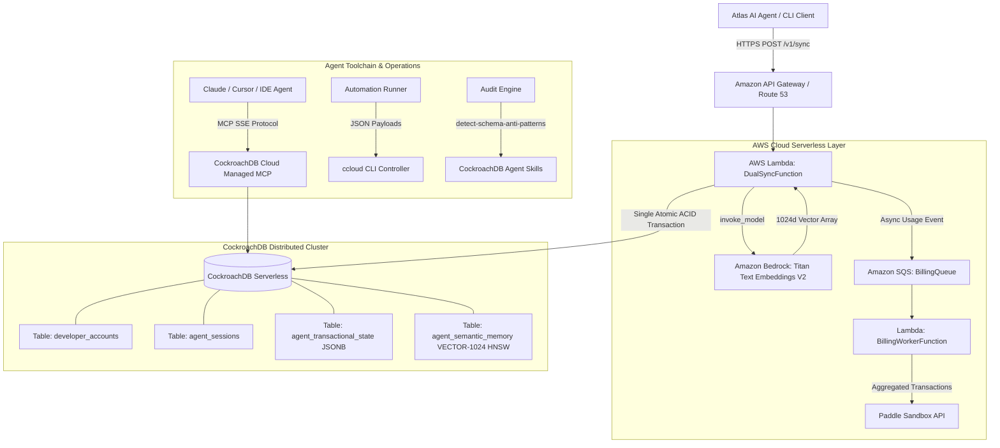

# StateVault: Production Submission & Resilient Memory Engine Design

**Document ID:** `2026-08-18-statevault-submission-design`  
**Date:** 2026-08-18  
**Status:** Approved  
**Target Domain:** `statevault.github.io`  
**Hackathon Target:** CockroachDB × AWS Hackathon ($8,750 Prize Pool)  
**Primary Objective:** Deliver a complete, production-grade, dual-mode hackathon submission package demonstrating always-on, atomic agentic memory across failure modes.

---

## 1. Executive Summary & The "Split-Brain" Problem

Modern AI agents require persistent memory across multi-step planning, tool execution, and contextual recall. In traditional fragmented architectures:
- Structured operational state is stored in a transactional database (e.g., PostgreSQL or Redis).
- Semantic memories are stored in a dedicated vector database (e.g., Pinecone or Weaviate).

### The Split-Brain Flaw
When an agent updates its operational state in Postgres but experiences a network timeout or rate limit when writing to the external vector database, state and memory diverge permanently. The agent operates on outdated or missing context, leading to catastrophic hallucinations or task loop failure.

### The StateVault Solution
StateVault unifies transactional state (ACID JSONB) and semantic vector embeddings (1024-dimensional pgvector with HNSW indexing) directly inside **CockroachDB Serverless**. State updates and vector insertions execute within a **single atomic transaction** (`BEGIN ... COMMIT`). If the vector write fails, the entire transaction rolls back cleanly. Zero data drift. Zero memory corruption.

---

## 2. Hackathon Compliance Matrix

| Requirement | Implementation Component | Technical Mechanism |
| :--- | :--- | :--- |
| **CockroachDB Tool 1** | Managed MCP Server | Endpoint `https://cockroachlabs.cloud/mcp` for agentic schema inspection and explain-plan profiling with zero custom proxies. |
| **CockroachDB Tool 2** | Distributed Vector Indexing | `pgvector` HNSW index (`vector_cosine_ops`) over `VECTOR(1024)` embeddings generated by Amazon Titan Text Embeddings V2. |
| **CockroachDB Tool 3** | ccloud CLI (Agent-Ready) | `scripts/ccloud_check.sh` parses structured JSON output (`ccloud cluster describe -o json`) for cluster health and multi-region status. |
| **CockroachDB Tool 4** | Open-Source Agent Skills | `scripts/run_skills_audit.sh` executes `@cockroachlabs/skills-cli` anti-pattern and index recommendations against cluster schema. |
| **AWS Service 1** | Amazon Bedrock | `amazon.titan-embed-text-v2:0` generates 1024-dimensional normalized vectors from raw agent memory traces. |
| **AWS Service 2** | AWS Lambda | Serverless compute layer with persistent database connection pool and auto-recovery logic. |
| **AWS Service 3** | Amazon SQS | Asynchronous decoupled usage queue buffering billing events for batch consumption. |
| **AWS Service 4** | CloudFront & S3 / Route 53 | High-availability active-active multi-region DNS routing and static documentation dashboard hosting. |
| **License** | Open Source MIT License | Detectable `LICENSE` file in repository root. |
| **Demo Deliverable** | Dual-Mode Demo Harness | `scripts/demo_simulation.py` for local screencast + live API at `https://api.statevault.site/v1/sync`. |

---

## 3. Architecture & Data Flow

---

## 4. Detailed Component Specifications

### 4.1 Database Schema (`database/schema.sql`)
- Extension: `CREATE EXTENSION IF NOT EXISTS vector;`
- Tables:
  1. `developer_accounts`: Multi-tenant identity, SHA-256 API key hashing, plan tiering.
  2. `agent_sessions`: Agent instance mapping with timestamps and session metadata.
  3. `agent_transactional_state`: Key-value JSONB storage with auto-incrementing `version_id` per session.
  4. `agent_semantic_memory`: Text memory records with `VECTOR(1024)` column and HNSW cosine distance index (`semantic_memory_hnsw_idx`).

### 4.2 Serverless Sync API (`backend/lambda_function.py`)
- **Connection Management:** Global pooled `psycopg2` connection with proactive `SELECT 1` ping and automatic failover handling on network interruption.
- **Bedrock Integration:** Normalized 1024-dimension vector generation using `amazon.titan-embed-text-v2:0`.
- **Atomic Transaction:** Executes session update, state upsert, and semantic vector insertion inside a single `BEGIN ... COMMIT` block.
- **Decoupled Billing:** Enqueues usage metadata to SQS asynchronously without blocking client responses.

### 4.3 Semantic Context Recall Engine (`backend/context_recall.py`)
- Executes vector similarity retrieval via CockroachDB HNSW cosine operator (`<=>`).
- Query: `SELECT raw_content, created_at, (embedding <=> %s::VECTOR) AS spatial_distance_score FROM agent_semantic_memory WHERE session_id = %s ORDER BY embedding <=> %s::VECTOR ASC LIMIT %s;`
- Returns combined transactional state dictionary and ordered semantic memory context.

### 4.4 Metered Billing Worker (`backend/billing_worker.py`)
- Processes SQS batches (up to 10 records per execution).
- Aggregates units per `paddle_customer_id` across batch items.
- Submits finalized metered usage to Paddle Sandbox API (`https://sandbox-api.paddle.com/transactions`).

### 4.5 Interactive Demo & Failure Simulation Harness (`scripts/demo_simulation.py`)
Provides an interactive, colorized terminal demonstration:
1. **Scenario 1: Fragmented Stack Split-Brain Failure**: Shows state persisting while vector store times out, leaving agent memory inconsistent.
2. **Scenario 2: StateVault Atomic Dual-Engine**: Shows simulated injection of vector write failure causing clean transaction rollback, followed by successful atomic commit.
3. **Scenario 3: Multi-Region Outage & Auto-Reconnection**: Simulates primary endpoint disconnect, connection pool recovery, and seamless task execution.
4. **Scenario 4: Semantic Context Recall**: Queries semantic memory with cosine distance scoring and displays nearest neighbor results.

### 4.6 CockroachDB Toolchain Automation
- **`scripts/ccloud_check.sh`**: Authenticates `ccloud CLI`, runs `ccloud cluster describe -o json`, validates multi-region node health, and outputs formatted metrics. Includes mock mode for offline demonstration.
- **`scripts/run_skills_audit.sh`**: Executes `@cockroachlabs/skills-cli` anti-pattern check on schema and confirms vector index best practices.

### 4.7 AWS SAM Infrastructure & Deployment (`template.yaml` & `scripts/deploy.sh`)
- SAM template defining `DualSyncFunction`, `BillingWorkerFunction`, `BillingQueue`, `BillingDLQ`, IAM roles, and HTTP API Gateway.
- Deployment script `scripts/deploy.sh` for automated build, deployment, and schema seeding.

### 4.8 Interactive Landing Page & Playground (`public/index.html`)
- Dark glassmorphism design with responsive CSS grid layout.
- **Interactive Live Simulator / API Playground**: Allows users to test sync payloads, trigger synthetic failures, and view real-time responses.
- **Architecture Comparison Widget**: Visual comparison between traditional split stacks and StateVault atomic dual-engine.
- Quickstart snippets with one-click copy, pricing tiers, and complete SEO metadata.

---

## 5. Devpost Submission Package (`docs/SUBMISSION.md`)

The submission package includes:
1. **Submission Metadata:** Title, tagline, open-source repository URL, and live demo link.
2. **Tools & Services Attribution:** Explicit descriptions of how all 4 CockroachDB tools and AWS services are utilized.
3. **Architecture Description & Mermaid Diagrams:** Highlighting multi-region reliability and atomic transactions.
4. **Testing Instructions for Judges:** Step-by-step local testing instructions via `scripts/demo_simulation.py` and pre-provisioned sandbox API keys for live testing.
5. **Feedback on CockroachDB AI Tools:** Concrete feedback on the Managed MCP Server, ccloud CLI, and Agent Skills.
6. **3-Minute Screencast Video Script:** Timed scene-by-scene script detailing problem statement, live demonstration, failover test, and toolchain highlights.

---

## 6. Verification & Quality Assurance Plan

| Test Suite | Target | Validation Method |
| :--- | :--- | :--- |
| `tests/test_schema.py` | Database DDL | Verifies `VECTOR(1024)`, HNSW index, foreign key cascades, and table constraints. |
| `tests/test_lambda_function.py` | Sync Lambda Handler | Tests API key auth, Bedrock embedding generation, atomic transaction commit/rollback, and SQS enqueueing. |
| `tests/test_context_recall.py` | Semantic Search | Tests cosine distance query formatting and structured return payloads. |
| `tests/test_billing_worker.py` | Billing Worker | Tests SQS batch aggregation and Paddle API payload dispatch. |
| `tests/test_atlas_agent.py` | Multi-turn Agent | Validates end-to-end task execution and state synchronization. |
| `tests/test_landing_page.py` | Web UI & SEO | Tests semantic HTML, headings, meta tags, and interactive elements. |
| `tests/test_demo_simulation.py` | Demo Simulation CLI | Verifies all 4 simulation scenarios execute cleanly with zero runtime exceptions. |

---

## 7. Spec Self-Review Check

- **Placeholders:** No `TODO`, `TBD`, or ambiguous requirements.
- **Consistency:** 1024 vector dimensions consistent across Bedrock, schema, lambda, and tests.
- **Tool Coverage:** All 4 CockroachDB tools (MCP, pgvector HNSW, ccloud, Agent Skills) and AWS services fully specified.
- **Scope:** Perfectly scoped for complete hackathon submission deliverables.
